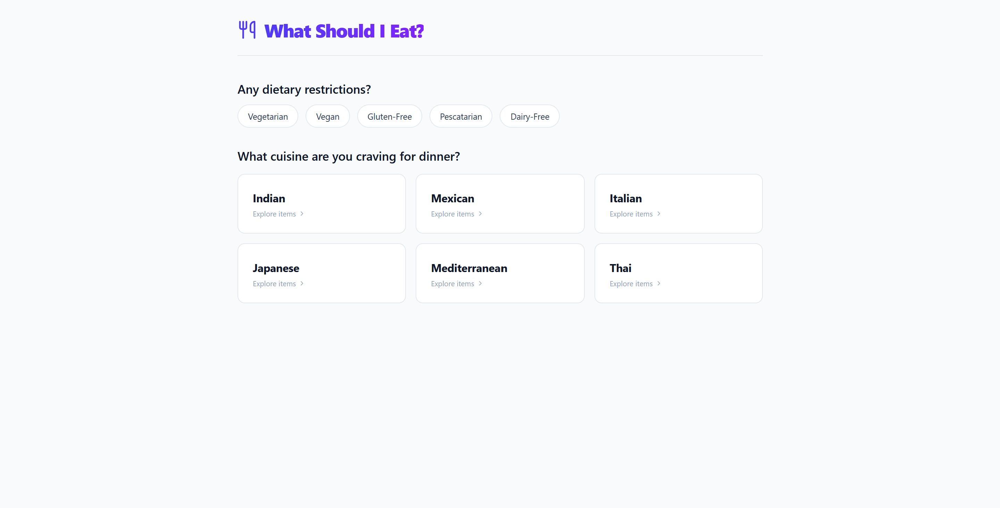
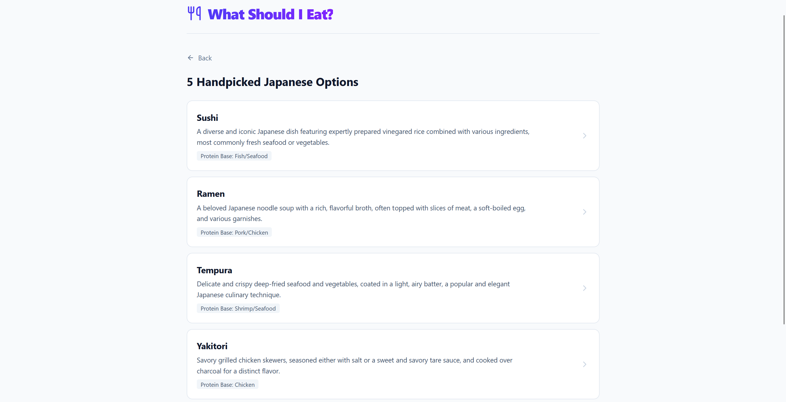
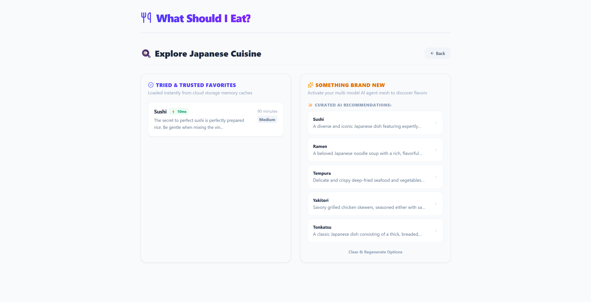
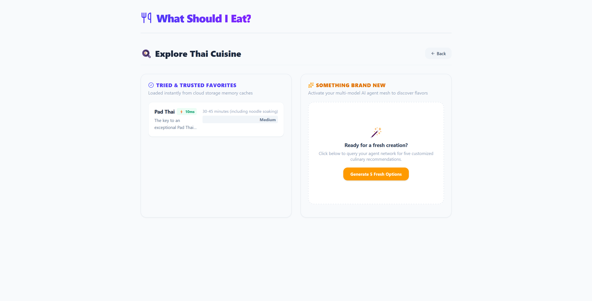
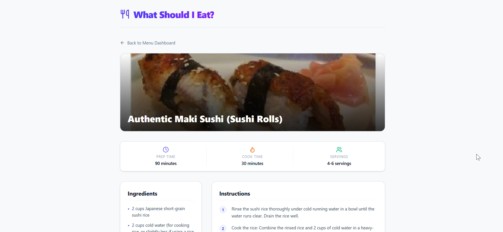

# What Should I Eat? 🍳

A full-stack, intelligent culinary recommendation platform that provides real-time, personalized menu curation and media-rich interactive recipes. Built using a hybrid data path architecture, the system balances ultra-low latency frontend views with an asynchronous, distributed analytics lakehouse to continuously capture and visualize operational metrics.

---

## 🏗️ System Architecture

The application is engineered around a decoupled, event-driven pipeline optimized across hot, warm, and cold data paths:

1. **Reactive Frontend UI (React + Tailwind CSS):** Handles micro-view routing, rendering dynamic media components, and enforcing state re-hydration loops. It intercepts backward navigation to automatically refresh telemetry matrices without forcing hard page reloads.
2. **Asynchronous Application Core (FastAPI + Uvicorn):** Coordinates the underlying AI agent mesh router. Leverages Python's concurrency patterns and background execution threads to decouple heavy downstream telemetry writes from the client request-response lifecycle.
3. **Hot Cache Layer (Redis Cloud):** Intercepts repetitive culinary queries with microsecond key-value lookups and maintains atomic mathematical collections (`SADD`) to track a user's historical culinary profile per cuisine.
4. **Core AI Engine (Google Gemini 2.5):** Evaluates user preferences on a standard cache miss, executing multi-model logic to dynamically output strictly structured recipe payloads.
5. **Analytical Lakehouse Path (Databricks + Delta Lake):** An asynchronous data streaming thread captures detailed transaction logs down to a centralized Delta Lake storage repository, entirely skipping blockages at runtime.
6. **Business Intelligence Visualization (Power BI):** Interfaces directly with the Databricks cluster via real-time **DirectQuery** pipelines. Utilizes native query folding to parse and expand text-stringified operational JSON telemetry directly on the lakehouse compute layer.

---

## 🛠️ Tech Stack

* **Frontend:** React.js, Tailwind CSS, Lucide Icons
* **Backend Framework:** FastAPI (Python 3.11+), Uvicorn
* **Caching & In-Memory Storage:** Redis Cloud (Redis Stack API)
* **LLM Core Platform:** Google Gemini API (`gemini-2.5-flash`)
* **Data Lakehouse:** Databricks (SQL Warehouses / Cluster Compute Layer)
* **Storage Standard:** Delta Lake (Parquet-backed ACID transaction log format)
* **Database Driver:** `databricks-sql-connector` (with optimized `pyarrow` vector transports)
* **Analytics Engine:** Power BI Desktop & Service (Power Query / Native SQL Injection)

---

## 📊 Database & Cache Schemas

### 1. Hot Cache & History (Redis)
* **Recipe Caching Engine:** `recipe:<dish_name_slug>` ➡️ Stores stringified JSON blocks of pre-generated recipe cards.
* **Telemetry Session Set:** `user:<user_id>:cooked` ➡️ An atomic set collection maintaining a list of dishes explored by the user.

### 2. Analytical Delta Lake (Databricks)
Target Table Location: `workspace.default.user_clicks`

| Column Name | Data Type | Description |
| :--- | :--- | :--- |
| `user_id` | STRING | Unique user identifier string |
| `dish_name` | STRING | Name of the selected culinary dish |
| `cuisine` | STRING | Normalized, lowercase cuisine category (e.g., `indian`, `thai`) |
| `tracking_context` | STRING | Operational telemetry routing flag (`DiscoveryFeed` \| `CachedCuisine`) |
| `timestamp` | TIMESTAMP | Automated server injection point via `CURRENT_TIMESTAMP()` |
| `recipe_details` | STRING | Raw, unparsed text-stringified JSON payload returned from the AI mesh |

---

## 💻 Installation & Local Deployment

### 1. Environment Configurations
Create a `.env` file within the root `backend/` directory:

```env
# Google Cloud AI Configuration
GEMINI_API_KEY=your_gemini_api_key_here

# Redis Cloud Endpoint Configuration
REDIS_HOST=your_redis_host_endpoint_string
REDIS_PORT=your_redis_port_integer
REDIS_PASSWORD=your_redis_auth_password_string

# Databricks Lakehouse Configuration
DATABRICKS_SERVER_HOSTNAME=your_databricks_server_hostname_string
DATABRICKS_HTTP_PATH=your_databricks_http_path_string
DATABRICKS_PERSONAL_ACCESS_TOKEN=your_personal_access_token_here
```

### 2. Spin Up the Backend Server
```
cd backend
python -m venv venv
source venv/bin/activate  # On Windows use: venv\Scripts\activate
pip install fastapi uvicorn redis google-genai databricks-sql-connector pyarrow
python main.py
```

### 3.Spin Up the Client Application
```
cd frontend
npm install
npm run dev
```

### 4. 🚀 Key Engineering Paradigms
Non-Blocking Telemetry Offloading

To ensure that cloud database connectivity overhead never lags user execution paths, analytical logging routines are detached from the main request thread. By wrapping blocking operations inside asyncio.to_thread and routing them through FastAPI's BackgroundTasks, logging jobs are offloaded asynchronously onto a worker pool thread.
Client-Side State Re-hydration

The application architecture overrides static layout assumptions by executing proactive asynchronous validation hooks (useEffect) paired with target backend endpoints. Whenever a user moves backward from a detailed recipe page to the dashboard layout, the frontend forces a fast context reload to sync newly processed historical array structures cleanly from the remote Redis cache.

---

## Application Preview:

### 1. Interactive Home Page 
User finds options to select the cuisine and dietary preferences:
<br>



### 2. Interactive Culinary Dashboard For First Time Visit
The user interface presents dynamic AI generation dishes matching selected cuisine and dietary restrictions:
<br>


### 3. Interactive Culinary Dashboard
The split-screen user interface handles caching status presentation on the left and dynamic AI generation tools on the right:
<br>


### 4. Interactive Culinary Dashboard
<br>


### 5. Media-Rich Recipe View
Includes dynamic asset loading for dish banners, micro-spec metadata tiles, structured instructions, and embedded video assistant guides Click below 👇:
<br>
 [](https://raw.githubusercontent.com/moreharsh/What_Should_I_Eat/blob/main/images/Recipe.mp4)

